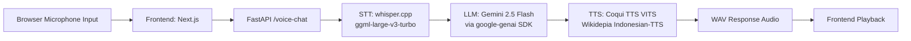

# Multilingual Code-Switching Speech-to-Speech System

Proyek UAS ini merupakan aplikasi chatbot berbasis suara yang memungkinkan pengguna berbicara langsung melalui antarmuka web. Sistem akan mengenali suara pengguna, mengubahnya menjadi teks (Speech-to-Text), memprosesnya menggunakan model bahasa besar (Gemini API), lalu mengubah hasil jawabannya kembali menjadi suara (Text-to-Speech).

## Student

- Mulia Andiki
- 2308107010013

## 📌 Fitur Utama

- 🎙️ Speech-to-Text (STT) menggunakan `whisper.cpp` dari OpenAI.
- 🧠 LLM Integration menggunakan Google Gemini API untuk menghasilkan respons dalam Bahasa Indonesia.
- 🔊 Text-to-Speech (TTS) menggunakan model Coqui TTS (Indonesian TTS).
- 🧪 Antarmuka pengguna interaktif berbasis `NextJs` untuk pengujian langsung dari browser.


An end-to-end NLP pipeline for multilingual speech interaction, built as an academic project.  
The system accepts voice input with code-switching behavior (Indonesian, English, Arabic), transcribes the audio, generates a contextual response using an LLM, and synthesizes the answer back into natural-sounding speech.

## Overview

This repository is organized as a decoupled web system:

- Frontend client in Next.js for browser-based audio recording and playback.
- Backend service in FastAPI for STT, LLM inference, and TTS generation.
- Speech stack designed for multilingual and code-switching conversations (ID-EN-AR).

## System Architecture

### Pipeline Flow

`Audio Input -> STT (whisper.cpp) -> LLM (Gemini 2.5 Flash) -> TTS (Coqui VITS) -> Audio Output`



## Tech Stack

### Frontend

- Next.js
- React
- Tailwind CSS

### Backend

- FastAPI
- Python

### Speech and Language Components

- STT: whisper.cpp with `ggml-large-v3-turbo`
- LLM: Google Gemini 2.5 Flash API via `google-genai`
- TTS: Coqui TTS (VITS) with Wikidepia Indonesian-TTS assets
- G2P: Indonesian grapheme-to-phoneme preprocessing for better pronunciation quality

## Key Features

- Real-time audio recording and playback directly in the browser.
- Decoupled architecture separating UI concerns from NLP and speech processing.
- Multilingual code-switching transcription support for Indonesian, English, and Arabic.
- Grapheme-to-Phoneme (G2P) normalization to improve Indonesian speech synthesis quality.

## Prerequisites

Before running this project, ensure you have:

- Python 3.9+
- Node.js 18+ and npm
- C/C++ build toolchain for whisper.cpp
  - Linux: `build-essential`, `cmake`, `git`
- FFmpeg installed and available in PATH
- Google Gemini API key

## Installation and Setup

The setup is separated into backend and frontend workspaces.

### 1) Backend Setup (FastAPI)

From the repository root:

```bash
cd fast-api
python -m venv .venv
source .venv/bin/activate
pip install -r requirements.txt
```

Build whisper.cpp (required for STT):

```bash
cd whisper.cpp
cmake -B build
cmake --build build -j
cd ..
```

### 2) Frontend Setup (Next.js)

From the repository root:

```bash
cd audio_app
npm install
```

## Environment Variables

Create a `.env` file inside `fast-api/`:

```bash
GEMINI_API_KEY=your_gemini_api_key_here
MODEL=gemini-2.5-flash

# Optional overrides
# WHISPER_BINARY=/absolute/path/to/whisper.cpp/build/bin/whisper-cli
# WHISPER_MODEL_PATH=/absolute/path/to/whisper.cpp/models/ggml-large-v3-turbo.bin
# FFMPEG_BINARY=ffmpeg
```

Notes:

- `GEMINI_API_KEY` is required for LLM responses.
- `MODEL` should match an available Gemini model in your account.
- Whisper variables are optional if you use the default repository paths.

## How to Run the Application

Open two terminals.

### Terminal 1: Run Backend API

```bash
cd fast-api
source .venv/bin/activate
uvicorn app.main:app --host 0.0.0.0 --port 8000 --reload
```

Backend health check:

- `GET http://localhost:8000/`

Main inference endpoint:

- `POST http://localhost:8000/voice-chat`

### Terminal 2: Run Frontend

```bash
cd audio_app
npm run dev
```

Open:

- `http://localhost:3000`

## Project Directory Structure

```text
application/
├── README.md
├── audio_app/                 # Next.js frontend (recording + playback UI)
│   ├── app/
│   ├── public/
│   └── package.json
└── fast-api/                  # FastAPI backend + NLP speech pipeline
		├── app/
		│   ├── main.py            # API routes and orchestration
		│   ├── stt.py             # STT integration via whisper.cpp
		│   ├── llm.py             # Gemini API integration
		│   ├── tts.py             # Coqui TTS + G2P normalization
		│   └── chat_history.json
		├── coqui_utils/           # Coqui model/config assets
		├── whisper.cpp/           # whisper.cpp source, models, and build artifacts
        ├── nlp.log             # Result Eksperimen Korpus Audio Training
		└── requirements.txt
```

## Academic Disclaimer

This project was developed for academic and research purposes as part of an NLP coursework assignment.  
The implementation is intended as a prototype to demonstrate end-to-end speech and language processing for multilingual code-switching scenarios.  
It is not yet optimized for production deployment, security hardening, or large-scale reliability.
